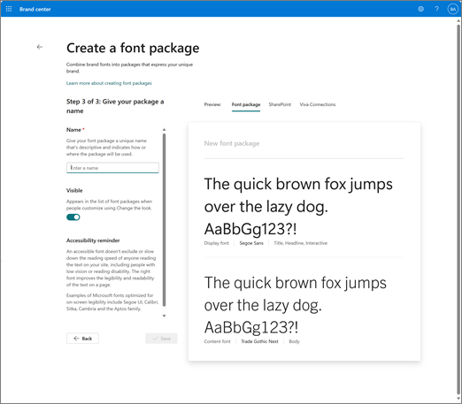
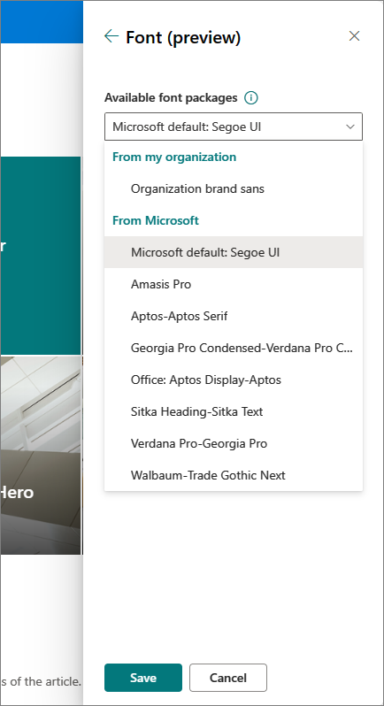

# Font packages

A font package is a collection of fonts that are packaged together. Font packages are used in SharePoint and Viva Connections to control how the fonts look in different areas within each product.

Typography provides the visual framework for presenting text. It's an important part of expressing a brand or creating a beautiful design. You'll often see multiple terms mixed or used interchangeably when referring to typography, such as typeface and fonts A typeface is the entire font family while a font is an individual font style. We often use these terms interchangeably. We refer to fonts to cover both scenarios for the SharePoint brand center.

> [!NOTE]
> Known Limitations:
>
> - Custom fonts are set at the site or Viva Connections experience level.
>- A font package applied to the Homesite backing the Viva Connections desktop experience also applies to the Viva Connections desktop experience.
>- A font package applied to the Viva Connections desktop experience also applies to the attached/associated SharePoint homesite.
>- Font packages will not be pushed down to hub associated sites.
> - Font packages cannot be deleted from the brand center app, they can be edited or made not visible to remove from selection experiences.

You have the option to select from the standard font packages or a custom font package for your organization to modify the fonts of your SharePoint site or Viva Connections experience. The font packages that Microsoft offers are created to build on the Microsoft brand, while also enabling versatility to invigorate our partnerships without overpowering them. They show our shared goals and personality, and they represent our diversity and ability to optimize your experiences.

## Default font packages

- Microsoft default: Segoe UI

- Amasis Pro

- Aptos-Aptos Serif

- Georgia Pro Condensed-Verdana Pro Condensed

- Office: Aptos Display-Aptos

- Sitka Heading-Sitka Text

- Verdana Pro-Georgia Pro

- Walbaum-Trade Gothic Next

These font packages have been designed for readability, so you might find them useful starting points for creating custom font packages.

## Anatomy of a font package

Each font package is composed of two font families. We consider these to be our Display and Content fonts.

### Display font

The display font is a more decorative or eccentric typeface that is used for larger and more prominent elements of text. A display font is often used to express the feel of a brand. These are often slab serif, script, decorative, uppercase only typefaces.

### Content font

The content font is used more widely to ensure consistency and legibility at all sizes. A content font should be identified and ideally have a range of weights and styles to fit a wide range of scenarios. This font should be considered as the baseline for most of your content and should be the most legible font from your brand.

## Font slot mappings

Font packages use four font slots that correspond to different parts of the experience. For each part, you pick a font and font style that will change the fonts of different components based on these chosen font styles. These include:

### Title

The title font is used to identify the most distinct items for your experience. Consider using your display font.

### Headline

The headline font is used for a variety of headings and titles in the experience. Consider your content font in a bold or semibold style.

### Body

The body font is used in more versatile ways and should be easy to read. Consider your content font in a normal or regular style.

### Interactive

The interactive font is used for items that trigger action, such as buttons. Consider using your content font with a bold or semibold style.

Create your own font packages  
In the SharePoint brand center, a brand manager is able to create custom font packages for your organization. These font packages are available in the Change the Look experience for site owners and Viva Connections operators to apply to their sites and experiences.

> [!NOTE]
> To create a custom font package, you must upload your organization’s fonts to the brand fonts library.

Visit the SharePoint or Viva Connections branding experiences and select **New Font Package**

**Step 1**: Select display and content fonts using the font families visible in your Brand fonts library. You can select up to two different font families, you can select the same font family for both display and content fonts if desired.

**Step 2**: Select your font family and font style for each of the four font slot mappings.

**Step 3**: Name your font package and preview in different experiences. Determine the Visible setting for your font package.

## Pay attention to Accessibility

An accessible font doesn't exclude or slow down the reading speed of anyone reading the text on your site, including people with low vision, or reading disability. The right font improves the legibility and readability of the text on a page.

To reduce the reading load, select familiar fonts such as Segoe UI or Aptos. Avoid using all capital letters and excessive italics or underlines.

A person with a vision disability might miss out on the meaning conveyed by particular colors. For example, add an underline to color-coded hyperlink text so that people who are color-blind know that the text is linked even if they can’t see the color. For headings, consider adding bold or using a larger font.

The text on your site should be readable in a high contrast mode. For example, use bright colors or high-contrast color schemes on opposite ends of the color spectrum. White and black schemes make it easier for people who are color-blind to distinguish text and shapes.

For instructions on how to work with fonts and text, go to [Add accessible content and links to a SharePoint Online site](https://support.microsoft.com/office/add-accessible-content-and-links-to-a-sharepoint-online-site-dc34fac7-32d7-4dcf-b694-2cc6115ac8b9#PickTab=Online_Modern_Experience) and [Add text to a SharePoint space](https://support.microsoft.com/office/add-text-to-a-sharepoint-space-1b88da65-b38f-4a77-984a-0d4e5d2faf0e).

## Use a font package to change the fonts in your experience

With the introduction of the brand center app, custom fonts become available to Site owners to use from the **Change the Look panel** to customize the look and feel of their content. Once you have created a font package for your organization the “From my organization” section of the Font packages dropdown to the **Change the Look** \> **Font (preview)** panel.

Learn more about [Change the Look.](https://support.microsoft.com/office/change-the-look-of-your-sharepoint-site-06bbadc3-6b04-4a60-9d14-894f6a170818)

## Font Packages in SharePoint

### Supported custom fonts components in SharePoint

Custom fonts are currently supported in the following areas:

1. Site header - site title

1. Hub header – hub title

1. Navigation (hub and site) – links and labels

1. News web part

1. Page title region

1. Quick links web part

1. Button

1. Dashboard for Viva Connections

1. Image web part

1. Site header - finish

1. Section heading

1. Hero web part

1. Sites web part

1. People web part

1. Call to action web part

1. Text web part (RTE)

1. All web part titles (from Microsoft)

## Font packages in Viva Connections

### Supported custom fonts components in Viva Connections

Custom fonts are currently supported in the following areas:

1. Welcome/Greeting text

1. Section Headings

1. Dashboard cards Level 1

1. Resources
