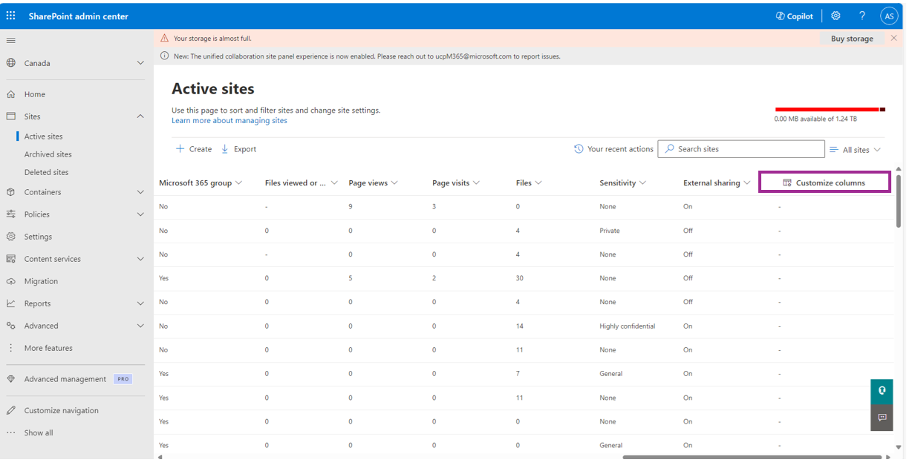
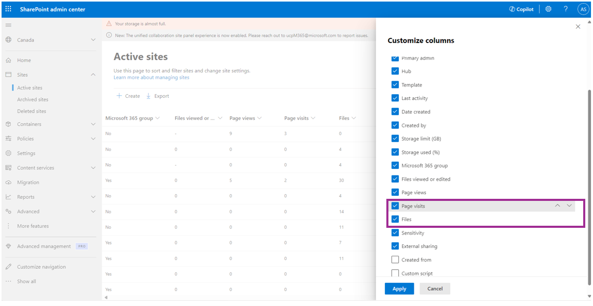
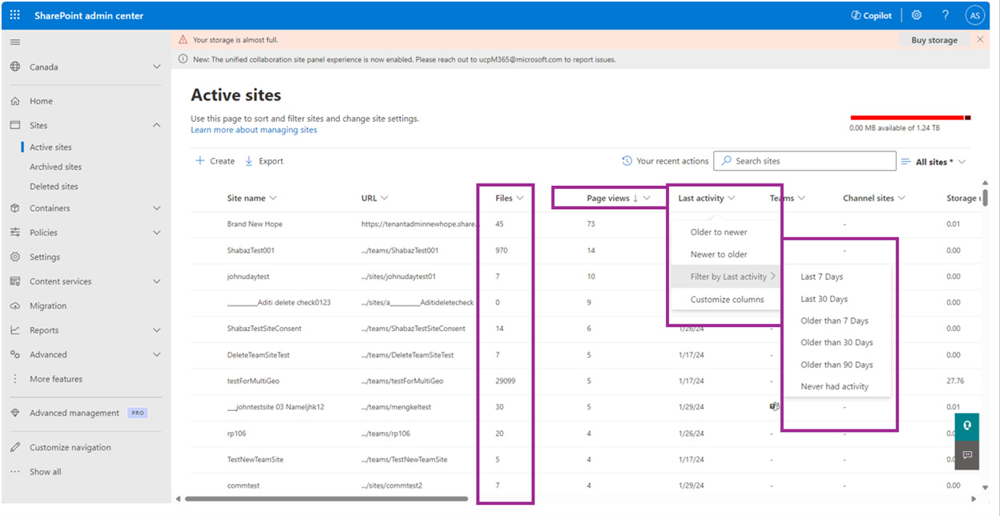
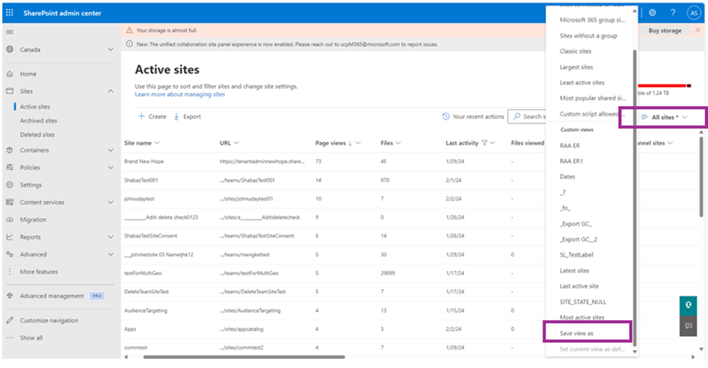
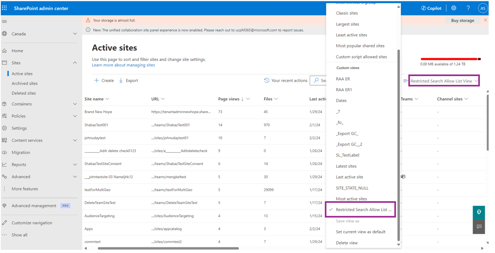
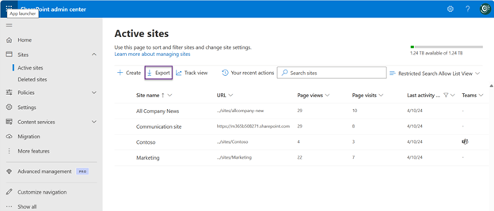
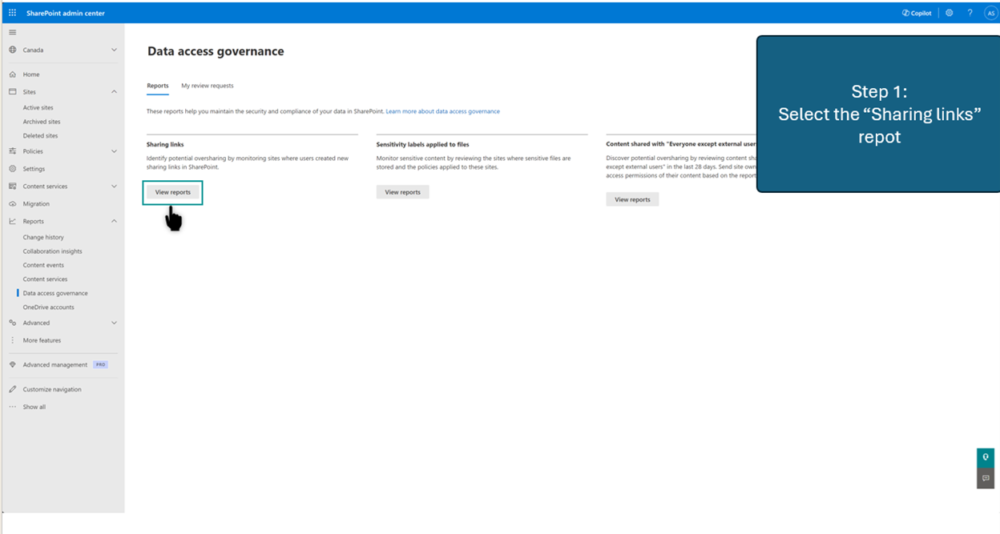

# Curate the allowed list for Restricted SharePoint Search
> [!IMPORTANT]
> Restricted SharePoint Search is designed for customers of Copilot for Microsoft 365. Visit [here](https://go.microsoft.com/fwlink/p/?linkid=2260808) and the [overview of Restricted SharePoint Search](/sharepoint/restricted-sharepoint-search) for more information.

As a Global and SharePoint admin, you can set up an allowed list of Restricted SharePoint Search with a maximum of 100 selected SharePoint sites. For Copilot and organization-wide search, besides the contents that they already have access to, either by direct sharing, visiting, or owning, your organization’s users will only be able to reach the sites on the allowed list, honoring these sites’ current permissions.

Setting up the allowed list in Restricted SharePoint Search gives you time to review and audit site permissions. But which sites should be included in the allowed list? This article introduces strategies and techniques for curating the allowed list.

## Steps to create the curated allowed list
To create a curated allowed list for Restricted SharePoint Search, we recommend you start by creating an initial list of sites. Then you work with your site admins and stakeholders to assess permissions and review the sites. Finally, you can [apply the list with PowerShell scripts as a Global admin](restricted-sharepoint-search-admin-scripts.md).

### Step 1: Get an initial list of sites

Every organization might have different criteria on what sites you choose to be searched across your organization and discoverable by Copilot. You can use SharePoint Admin Center (SPAC) features to identify sites that can be part of the allowed list based on your own criteria. To keep the list manageable, we recommend starting with the following two types of sites when for the allowed list:

- **The “Known” sites**: You and your SharePoint site admins already know set of sites from your organization that are safe to participate in organization wide search and the Copilot experience. These sites can be included in the allowed list.

- **The top active and shared sites**: the allowed list affects what users can see in their organization-wide search results and their Copilot experience. To optimize users’ search and Copilot experience, the hypothesis is that those top active and shared sites need to be included in the allowed list.  Depending on your license, you can use either the SharePoint Admin Center (SPAC) or the SharePoint Admin Center Data access governance (SPAC DAG) Activity(sharing) report to identify the most active and shared sites.

### Step 2: Review site permissions

Once you have the list of sites (up to 100), make sure the site permissions and content controls are implemented well enough to make them visible for search and Copilot experience. You can work with your site admins and stakeholders to assess permissions and review the sites.

>[!NOTE]
>The limit of up to 100 SharePoint sites includes Hub sites, but not their sub-sites.   When you enable Hub sites, the sub-sites under a Hub site are included in the allowed-list  but do not count towards the 100-site limit. So if you are picking Hub sites, make sure all the child sites have proper permissions.

### Step 3: Use PowerShell Scripts to apply the allowed list

After you review permissions in your curated sites, you can use PowerShell Scripts to turn on Restricted SharePoint Search, add, and remove sites. You can also use PowerShell Scripts to get the list of all sites in your allowed list.

## Find the most active and shared sites

You can find the most active sites using the SharePoint Admin Center (SPAC). If you have [either Microsoft 365 E5 licensing or Microsoft Syntex - SharePoint Advanced Management](/SharePoint/data-access-governance-reports#requirements), you can also use SPAC DAG to find the most shared sites.  

- **Using SharePoint Admin Center (SPAC):** If your organization has SharePoint, you have access to SPAC. You can get this list of sites using SPAC Active sites feature that had most page views and files in the last 30 days. This can be an indicator to get to the list of sites interested by the broadest possible audience in the organization.   

- **Using SPAC DAG Activity(sharing) report** to [identify sites](/SharePoint/data-access-governance-reports) that have been shared most in the last 28 days.

### Use SharePoint Admin Center (SPAC) to find the most active sites

Admins can use SharePoint Admin Center (SPAC) features to identify sites that can be part of the allowed list based on their criteria. The [Active sites page in the SharePoint admin center](https://go.microsoft.com/fwlink/?linkid=2185220) lets you  view the SharePoint sites in your organization. Based on your organization’s needs, you can [sort and filter sites](/sharepoint/customize-admin-center-site-list#sort-and-filter-the-site-list) based on columns such as Last activity, Page views, Page visits. You can search for sites, and [customize the columns and views](/sharepoint/customize-admin-center-site-list#customize-columns).

**Step 1:** In SPAC left pane, select “Active Sites.”

**Step 2:** Using the sorting and filtering functionality of the Active sites you can curate top 100 sites based on your organization needs and create a custom view.

**Step 3:** First move the columns by scrolling to right and clicking the “Customize columns”.  

Use up and down arrows next to each column's name to move up the Page Views and Files next to the URL, so it's easy for you to see the important columns together for analysis.  

**Step 4:** To create custom view of the top 100 sites sorted by “page views” for last 30 days do the following:  

1. Select the arrow next to the column header of **Page views** and select **Large to Small**.

1. Select the arrow next to the column header of **Last activity** select on the **Filter by last activity**> **Last 30 days**.

1. You can use the other columns to sort, or filter based on your needs.

**Step 5:** Once you're done with your sorting and filtering, you can create a custom view based on your current setting, and save it for future use. To create a custom view, select **All sites** > **Save view as**.

Enter a name for your custom view:

Your saved custom view is now available for you to choose from the drop-down menu next time.

  **Step #6:** Export the sites and manage the list in CSV file that you can use to add to the list by selecting the **Export** tab.

Your exported CSV file looks similar to the following CSV file:

### Use SPAC DAG Activity (sharing) report to find most shared sites

The SPAC DAG report (Data access governance reports for SharePoint sites) is part of [SharePoint admin center](https://go.microsoft.com/fwlink/?linkid=2185219). Admins with Microsoft 365 E5 licensing or Microsoft Syntex - SharePoint Advanced Management can access this report. This report helps you identify potential sites that are active and shared in the last 28 days.   

**Step 1:** In the left pane, select **Reports** > **Data access governance**. Select the **Sharing links** report.

**Step #2:** In the right pane **Sharing Links** page, select on the **Anyone links** report.

**Step #3:** **"Anyone" links** report gives you a list of sites in which the highest number of Anyone links were created. These links let anyone access files and folders without signing in. These sites might be great candidates to allow in tenant/org wide search.

## Resources

[Microsoft Copilot for Microsoft 365 - best practices with SharePoint](/sharepoint/sharepoint-copilot-best-practices)
